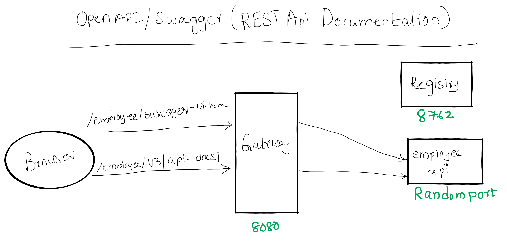

# Spring Cloud Session 5 Microservices Documentation
In this tutorial we are going to learn how do we document REST API microservices using **OpenAPI/Swagger**.
- Swagger is one of the mostly used standard while documenting REST API services.
- We will use SpringFox to produce Swagger/OpenAPI documentation.

**Overview**
- We will be using SpringFox to document employee-api , payroll-api
- API documentation will be viewed via gateway.
- Access Swagger UI of employee-api and make few rest calls.
- Import OpenAPI definition to postman to generate client code.

**Important Notes**
- Please refer my previous sessions to understand how these microservices work. In this session we will focus on documenting
API and accessing API documentation.
- Using SpringFox we can have API code and documentation present in same source files, This makes  api documentation doesn't 
go out of sync with code.
- In 2015, SmartBear Software donated the Swagger specification to the Linux Foundation under the OpenAPI Initiative 
and created the OpenAPI Specification. To create the API documentation, we will use SpringFox.
- We will not be focusing on in depth SpringFox annotations our goal is to quickly enable documentation for RESTAPI.
 

# Source Code 
``` git clone https://github.com/balajich/spring-cloud-session-5-microservices-documentation.git ``` 
# Video
[](https://www.youtube.com/watch?v=5WuallBaMnw)
- https://youtu.be/5WuallBaMnw
# Architecture

# Prerequisite
- JDK 1.8 or above
- Apache Maven 3.6.3 or above
# Clean and Build
- Java
    - ``` cd spring-cloud-session-5-microservices-documentation ``` 
    - ``` mvn clean install ```
 
# Running components
- Registry: ``` java -jar .\registry\target\registry-0.0.1-SNAPSHOT.jar ```
- Employee API: ``` java -jar .\employee-api\target\employee-api-0.0.1-SNAPSHOT.jar ```
- Payroll API: ``` java -jar .\payroll-api\target\payroll-api-0.0.1-SNAPSHOT.jar ```
- Gateway: ``` java -jar .\gateway\target\gateway-0.0.1-SNAPSHOT.jar ``` 

# Accessing Swagger UI  of employee and payroll api
- OpenAPI definition of employee api ``` curl -s -L http://localhost:8080/employee/v3/api-docs/  ```
- Swagger UI of employee api via gateway: ```  http://localhost:8080/employee/swagger-ui.html ```
- OpenAPI descriptions of payroll api ``` curl -s -L http://localhost:8080/payroll/v3/api-docs/  ```
- Swagger UI of payroll api via gateway: ```  http://localhost:8080/payroll/swagger-ui.html ```

# Code
In **employee-api** pom.xml add dependency **springdoc-openapi-ui**.
```xml
 <dependency>
            <groupId>org.springdoc</groupId>
            <artifactId>springdoc-openapi-ui</artifactId>
            <version>1.2.32</version>
        </dependency>
```
Set swagger-ui and api-docs paths to be accessible on employee context, So that they can be accessed from gateway easily.
```yaml
springdoc:
  swagger-ui:
    path: /employee/swagger-ui.html
  api-docs:
    path: /employee/v3/api-docs/
```
**Note**: I didn't customize the documentation generated by SpringFox, if need please use appropriate annotations.

# Next Steps
- How deploy microservices using docker

# References
 - Hands-On Microservices with Spring Boot and Spring Cloud: Build and deploy Java microservices 
using Spring Cloud, Istio, and Kubernetes -Magnus Larsson
- Spring Microservices in Action by John Carnell 

# Next Tutorial
- https://github.com/balajich/spring-cloud-session-6-microservices-deployment-docker